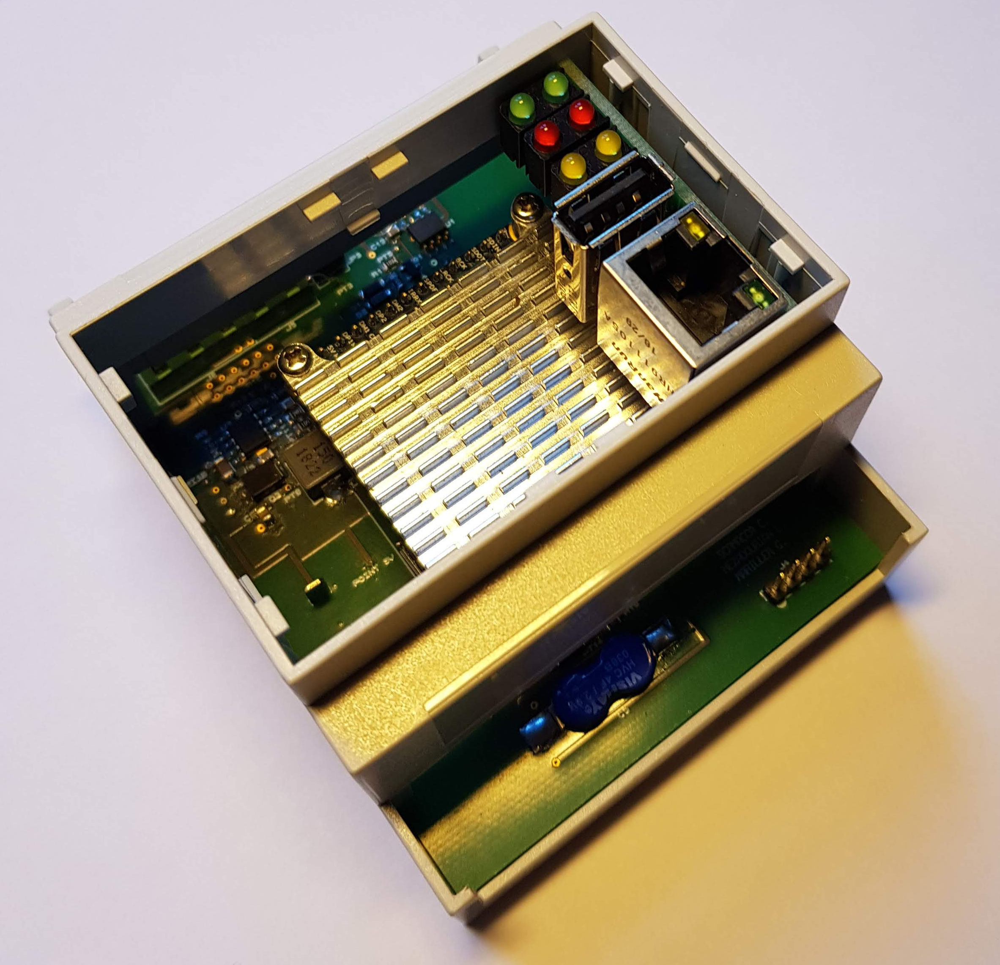
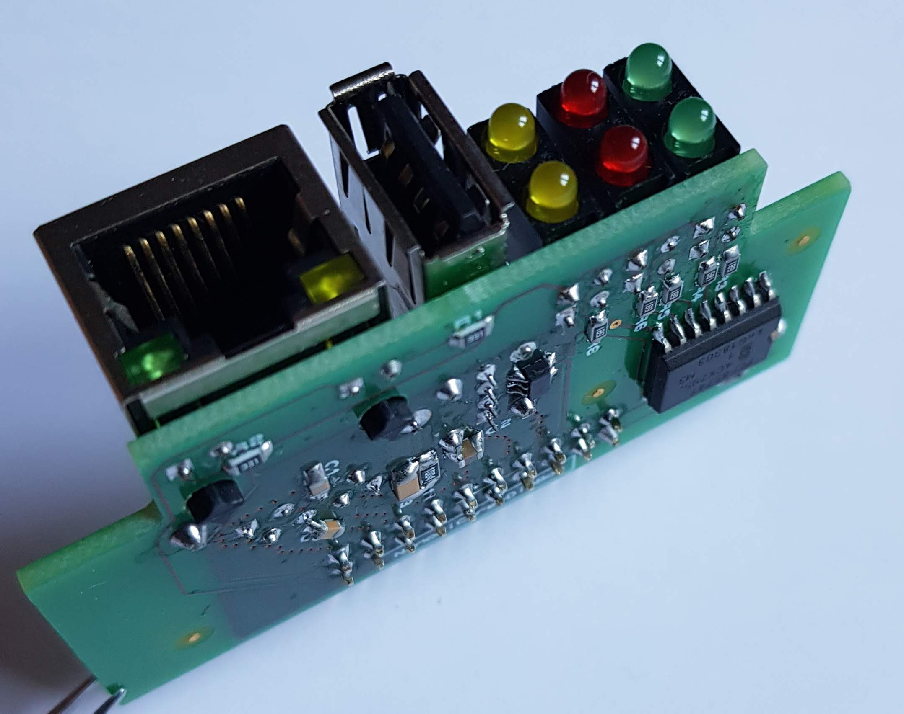
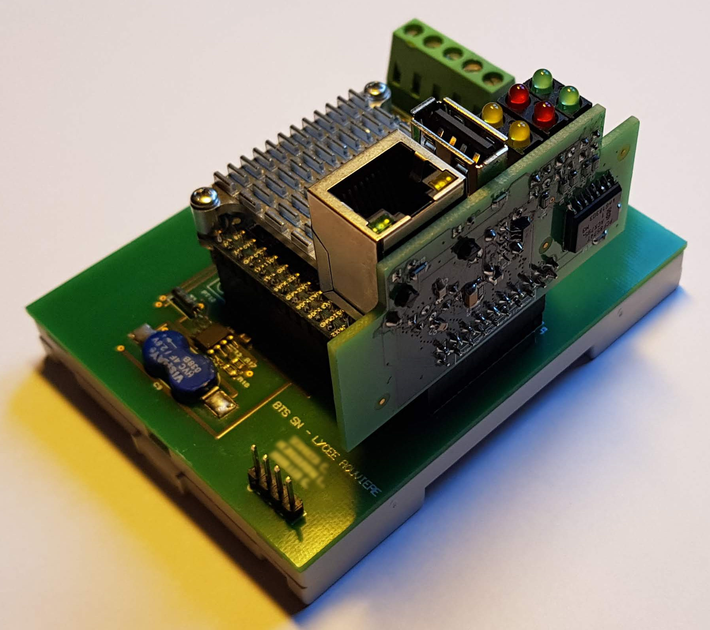
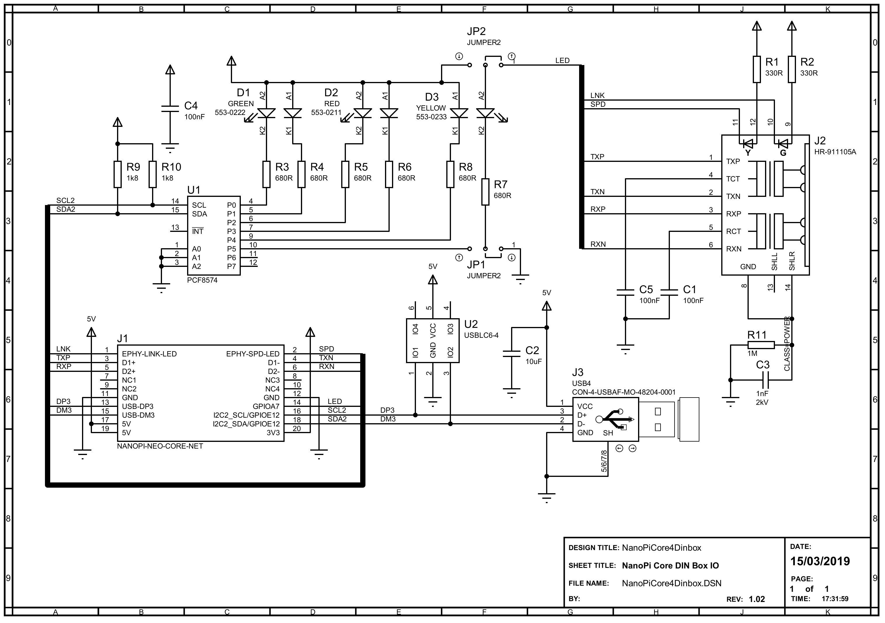

# NanoPiCore4DinBox

NanoPiCore4DinBox is a board that allows the integration of a [Nano Pi Neo Core](http://nanopi.io/nanopi-neo-core.html)/[Core2](http://nanopi.io/nanopi-neo-core2.html) in a DIN box.  
This provides ETH and USB interfaces and 6 LEDs on the front of the box.

|  |  | 
|:--:|:--:| 
| *NanoPiCore4DinBox in its DIN box (4 modules wide)* | *NanoPiCore4DinBox alone* |

The NanoPiCore4DinBox board is installed vertically in the box and connected to the NanoPiCore by the GPIO3 connector on the backplane board.

|  |  | 
|:--:|:--:| 
| *Placing the NanoPiCore4DinBox on the backplane* | *3D modeling in Proteus* |

The LEDs are controlled by a PCF8574 circuit connected to the NanoPi by the I2C bus #2.

|  | 
|:--:| 
| *NanoPiCore4DinBox electronic diagram* |
