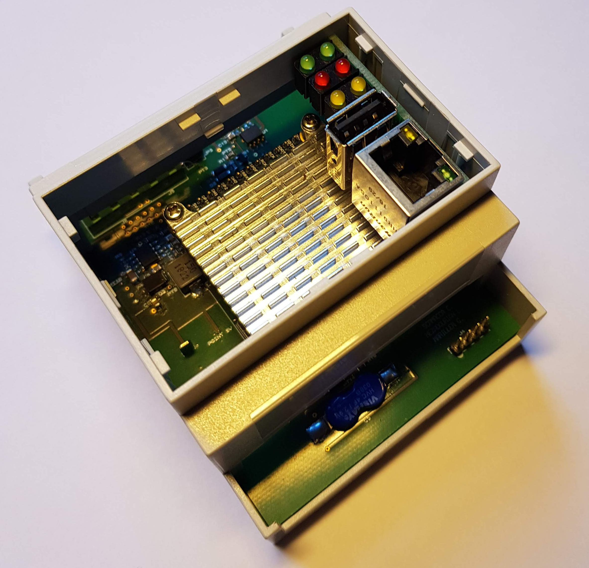
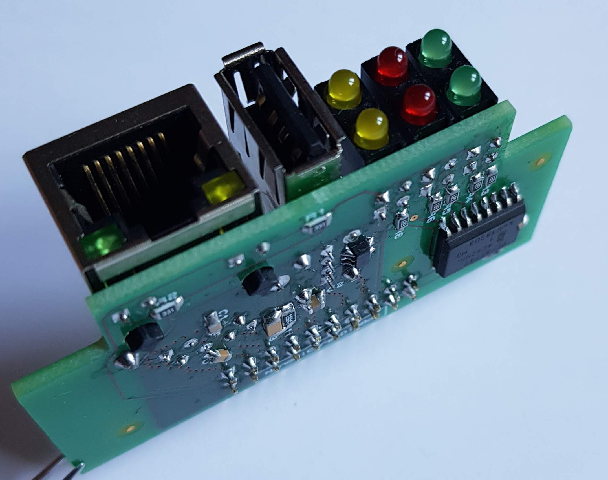
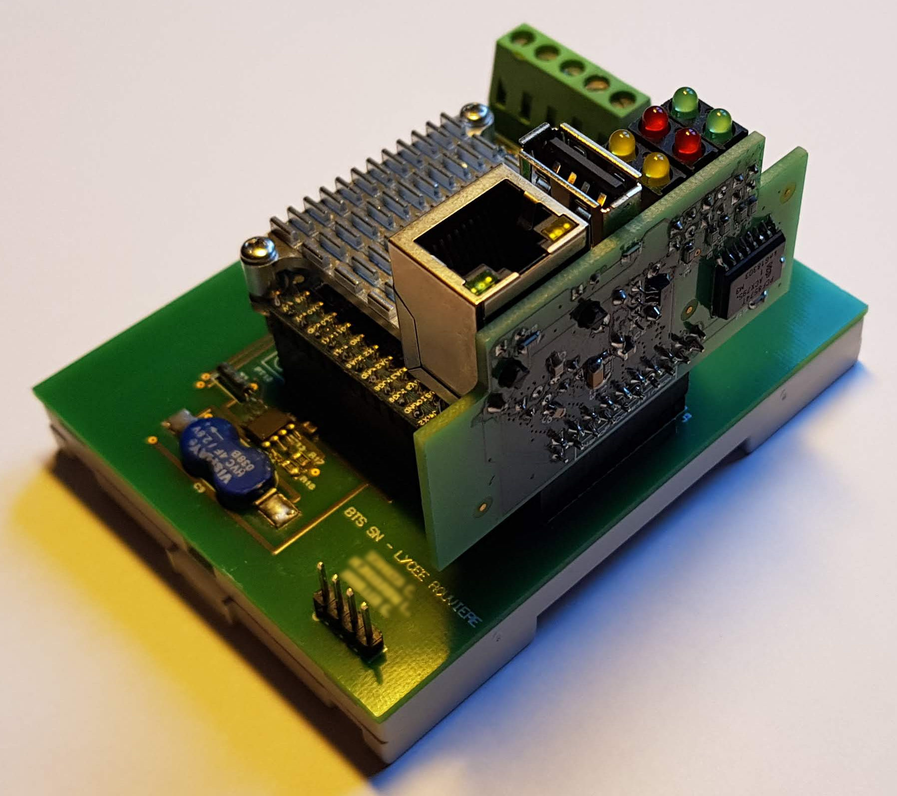
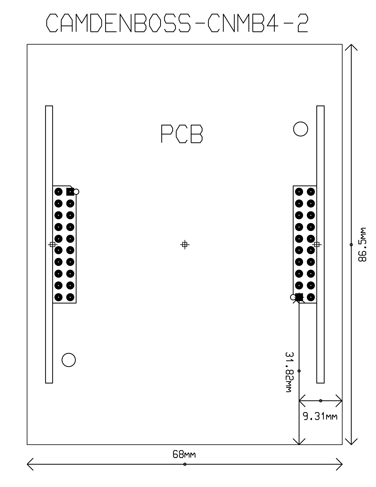
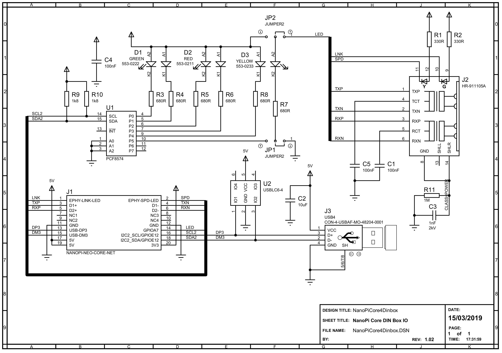
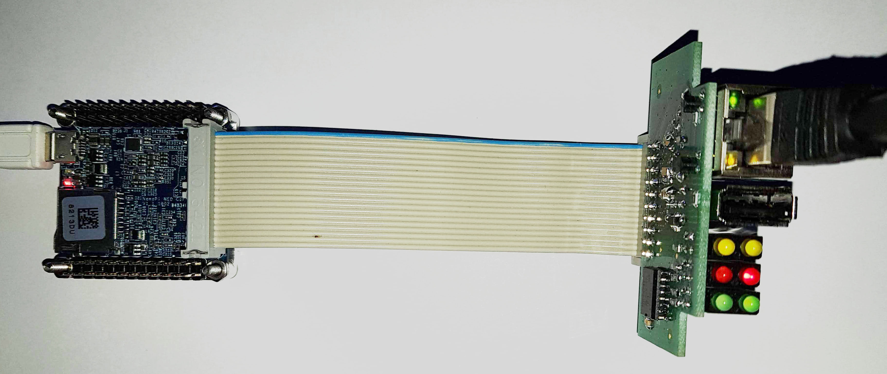
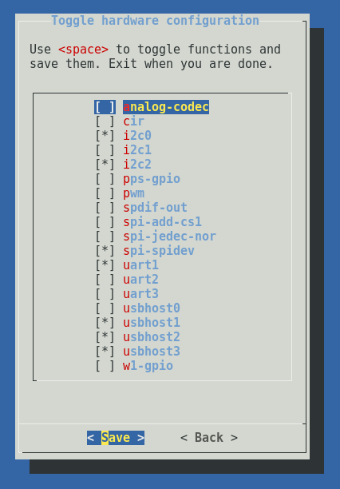

# NanoPiCore4DinBox
_NanoPi Neo Core in a DIN box_

<a href="https://www.oshwa.org/">
  
</a>

NanoPiCore4DinBox is a board that allows the integration of a [Nano Pi Neo Core](http://nanopi.io/nanopi-neo-core.html) in a DIN box.  
The dimensions of the board are provided for a CAMDENBOSS [CNMB](https://www.camdenboss.com/cnmb/) series box.  
This provides ETH and USB interfaces and 6 LEDs on the front of the box (or 4 LEDs and 1 push-button).

|  |  | 
|:--:|:--:| 
| *NanoPiCore4DinBox in its DIN box (4 modules wide)* | *NanoPiCore4DinBox alone* |

<a rel="license" href="http://creativecommons.org/licenses/by/4.0/"></a><br />This work is licensed under a <a rel="license" href="http://creativecommons.org/licenses/by/4.0/">Creative Commons Attribution 4.0 International License</a>.

The NanoPiCore4DinBox board is installed vertically in the box and connected to the NanoPiCore by the GPIO3 connector on the backplane board.

|  |  | 
|:--:|:--:| 
| *Placing the NanoPiCore4DinBox on the backplane* | *Proteus ARES PCB template* |


The LEDs are controlled by a PCF8574 circuit connected to the NanoPi by the I2C bus #2.

|  | 
|:--:| 
| *NanoPiCore4DinBox electronic diagram (v1.02)* |

As can be seen in this diagram, the board is equipped with 3 x 2 LEDs.
Led D3: 2 is connected to jumpers JP1 and JP2 which allow you to choose between a command with pin P5 of the PCF8574 or with pin GPIOA7 (default). This will allow this led to be assigned to a trigger from the kernel (heartbeat, power ...).

All hardware information can be found in the [hardware folder](https://github.com/epsilonrt/NanoPiCore4DinBox/tree/master/hardware).
 
The PCB (v1.1) can be purchased for a low price by clicking on the button below :

<a href="https://PCBs.io/share/zkPvx"></img></a>

# Quickstart guide

To make a first connection, it is possible to connect the board to the NanoPi Neo Core with a 20-pin ribbon connector.
Warning ! you must be careful to connect pin 1 of the NanoPi Neo Core to pin 1 of the NanoPiCore4DinBox (The red wire, the red button ;-)

|  | 
|:--:| 
| *Connecting the NanoPiCore4DinBox to the NanoPi Neo Core with ribbon cable (for test purposes)* |

## Setting up the hardware

Buses I2c #2 and USB #3 must be activated, this can be done using armbian-config (System > Hardware) :

|  | 
|:--:| 
| *Enabling I2c #2 and USB #3 buses with armbian-config* |


After restarting, we can check the operation of the LEDs from the command line.

First install the i2c tools:

    pascal@p01:~$ sudo apt install i2c-tools

Then we will check that the PCF8574 circuit which controls the LEDs is detected:

    pascal@p01:~$ sudo i2cdetect -y 2
           0  1  2  3  4  5  6  7  8  9  a  b  c  d  e  f
      00:          -- -- -- -- -- -- -- -- -- -- -- -- -- 
      10: -- -- -- -- -- -- -- -- -- -- -- -- -- -- -- -- 
      20: 20 -- -- -- -- -- -- -- -- -- -- -- -- -- -- -- 
      30: -- -- -- -- -- -- -- -- -- -- -- -- -- -- -- -- 
      40: -- -- -- -- -- -- -- -- -- -- -- -- -- -- -- -- 
      50: -- -- -- -- -- -- -- -- -- -- -- -- -- -- -- -- 
      60: -- -- -- -- -- -- -- -- -- -- -- -- -- -- -- -- 
      70: -- -- -- -- -- -- -- --                         

We can see that it is present at the address I2C 0100000, i.e. 0x20.

Then we will turn on all the leds: 

    pascal@p01:~$ sudo i2cset -y 2 0x20 0

you can also turn on the leds connected to P1, P4 and P3:

    pascal@p01:~$ sudo i2cset -y 2 0x20 0x25

or turn on the leds connected to P0, P2 and P5:

    pascal@p01:~$ sudo i2cset -y 2 0x20 0x1A

Finally we can turn off all the LEDs:

    pascal@p01:~$ sudo i2cset -y 2 0x20 0x3F

Well let's see now how to control the leds from a program.  
We will use the [piduino](https://github.com/epsilonrt/piduino) library which must be installed as indicated in its [README](https://github.com/epsilonrt/piduino#quickstart-guide).

We can use CodeLite to create a new project from the piduino model. If Codelite is not installed, it will have to be done:

    pascal@p01:~$ sudo apt install codelite codelite-plugins gdb hicolor-icon-theme gtk2-engines-pixbuf xfce4-terminal libatk-adaptor libgail-common libcanberra-gtk-module

Then:

1. Launch CodeLite then create or open a workspace  
2. Create a new project, choose **Simple executable (C++ piduino)** in the **Console** category.  
3. Enter the source code of the program below  

```cpp
#include <Piduino.h> 
#include <Wire.h>

void setup() {
  // initializes the i2c bus number 2
  Wire.begin(2);
}

void loop () {
  // Press Ctrl+C to abort ...
  
  Wire.beginTransmission (0x20);  // transmit to the PCF8574
  Wire.write (0x00);              // turn on all leds
  Wire.endTransmission ();   
  delay (1000);                   // wait for a second
  
  Wire.beginTransmission (0x20);  // transmit to device
  Wire.write (0x3F);              // turn off all leds
  Wire.endTransmission ();
  delay (1000);                   // wait for a second
}
```

You can then build your program (F7), then launch it (CTRL + F5). You should see all the LEDs flash.


[](extras/images/blink.mp4 "Blink")


If you have a permission error, you must add your user to the `i2c` group then reboot :

    pascal@p01:~$ sudo adduser $USER i2c
    pascal@p01:~$ sudo reboot

This program is available in the [examples folder](https://github.com/epsilonrt/NanoPiCore4DinBox/tree/master/examples).


If you don't want to use Codelite, you can enter the source code with your favorite editor then build with gcc:

    pascal@p01:~$  g++ -o nanopicore4dinbox-test main.cpp $(pkg-config --cflags --libs piduino)
    pascal@p01:~$ ./nanopicore4dinbox

# USB and Ethernet benchmark

If you want to check the performance of the USB or Ethernet links you can do the operations below.

## USB Port #3

Insert a USB key in the USB connector of NanoPiCore4DinBox, then check that its partition is detected :

    pascal@p01:~$ sudo dmesg | tail -n 20
      [ 3208.565853] usb 5-1: new high-speed USB device number 4 using ehci-platform
      [ 3208.722946] usb 5-1: New USB device found, idVendor=abcd, idProduct=1234, bcdDevice= 1.00
      [ 3208.722966] usb 5-1: New USB device strings: Mfr=1, Product=2, SerialNumber=3
      [ 3208.722978] usb 5-1: Product: UDisk           
      [ 3208.722990] usb 5-1: Manufacturer: General 
      [ 3208.723001] usb 5-1: SerialNumber: Љ
      [ 3208.724253] usb-storage 5-1:1.0: USB Mass Storage device detected
      [ 3208.725170] scsi host0: usb-storage 5-1:1.0
      [ 3209.735388] scsi 0:0:0:0: Direct-Access     General  UDisk            5.00 PQ: 0 ANSI: 2
      [ 3209.737440] sd 0:0:0:0: [sda] 15728640 512-byte logical blocks: (8.05 GB/7.50 GiB)
      [ 3209.738423] sd 0:0:0:0: Attached scsi generic sg0 type 0
      [ 3209.739272] sd 0:0:0:0: [sda] Write Protect is off
      [ 3209.739300] sd 0:0:0:0: [sda] Mode Sense: 0b 00 00 08
      [ 3209.740327] sd 0:0:0:0: [sda] No Caching mode page found
      [ 3209.740359] sd 0:0:0:0: [sda] Assuming drive cache: write through
      [ 3209.747612]  sda: sda1
      [ 3209.755879] sd 0:0:0:0: [sda] Attached SCSI removable disk

Mount the partition on the `/mnt` folder :

    pascal@p01:~$ sudo mount /dev/sda1 /mnt
    pascal@p01:~$ cd /mnt

Write an empty 64MB file with `dd` to test the writing speed :

    pascal@p01:/mnt$ sudo sync && sudo dd if=/dev/zero of=./testfile bs=64k count=1k && sudo sync
      1024+0 records in
      1024+0 records out
      67108864 bytes (67 MB, 64 MiB) copied, 0,906438 s, 74,0 MB/s

The measured speed depends, of course, on the USB key ...

You can also use `hdparm` to test the reading speed:

    pascal@p01:/mnt$ sudo hdparm -Tt /dev/sda
      /dev/sda:
       Timing cached reads:   678 MB in  2.00 seconds = 338.93 MB/sec
       Timing buffered disk reads:  46 MB in  3.08 seconds =  14.93 MB/sec

## Ethernet port

To perform a network benchmark, we use `iperf` (which must be installed), 
then we launch `iperf` in server mode on the NanoPi Neo Core:

    pascal@p01:~$ iperf -s
      ------------------------------------------------------------
      Server listening on TCP port 5001
      TCP window size: 85.3 KByte (default)
      ------------------------------------------------------------

then we start the measurement from a client PC:

    pascal@xwing:~$ iperf -c p01
      ------------------------------------------------------------
      Client connecting to p01, TCP port 5001
      TCP window size: 85.0 KByte (default)
      ------------------------------------------------------------
      [  3] local 10.201.196.144 port 38650 connected with 10.201.196.2 port 5001
      [ ID] Interval       Transfer     Bandwidth
      [  3]  0.0-10.0 sec   112 MBytes  94.0 Mbits/sec

The measured speed is 94 Mbits/sec (very close to the theoretical 100 Mbits/sec).

With a NanoPi Neo Core2 and a NanoPiCore4DinBox in version 1.1 connected to a 
Gigabit network, we also find performance very close to 1000 MBits/sec:

    pascal@xwing:~$ iperf -c p02
      ------------------------------------------------------------
      Client connecting to p02, TCP port 5001
      TCP window size: 85.0 KByte (default)
      ------------------------------------------------------------
      [  3] local 10.201.196.144 port 53254 connected with 10.201.196.3 port 5001
      [ ID] Interval       Transfer     Bandwidth
      [  3]  0.0-10.0 sec  1.08 GBytes   930 Mbits/sec
